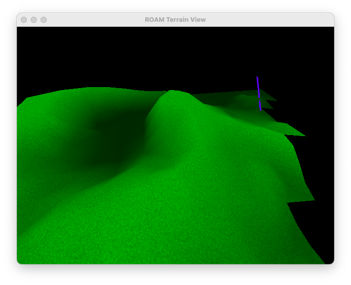

<br/>
<p align="center">
  <h3 align="center">ROAMSimple SDL</h3>

  <p align="center">
    Port of Bryan Turner's ROAM Real-Time Dynamic Level of Detail Terrain Rendering demo.
    <br/>
    <br/>
  </p>
</p>



## About The Project

This is a port of Bryan Turner's Real-Time Dynamic Level of Detail Terrain Rendering with ROAM demo.

The original article can be found on https://www.gamedeveloper.com/programming/real-time-dynamic-level-of-detail-terrain-rendering-with-roam, and a version that I made is available as article.pdf, on the root of the repository.

The original code was written using GLUT, for Win9X platforms, in the early 2000s, and will not run on newer platforms. It was not available on the above link anymore, but I could download it using archive.org. It is available in the _original_src folder - nothing was changed.

My port basically replace GLUT with SDL2 to manage the window, events and so on, but retains most of the ROAM code as close as the original as possible. There are some codestyle changes, and a little refactor, but nothing major.

## Built With

SDL2, OpenGL, CMake, C++, CLion

## Getting Started

The project was made on Windows, with Jetbrains' CLion IDE using the Microsoft Visual Studio 2022 toolchain. However, it should compile under Linux aswell (tested on Kubuntu).

### Prerequisites

The SDL2 library is required.

* SDL2
   * Windows: download the binaries and place them wherever you want. Create a environment variable named **SDL2DIR** that points to the root directory of the SDL2 binaries.
   * Linux: install the SDL2 and SDL2-dev packages using the package manager of your distro.

### Installation

1. Clone the repo

```sh
git clone https://github.com/roverdiani/ROAMSimple.git
```

2. Open and build the project using CLion, or use CMake directly to build it.

3. On Windows, copy the SDL2.dll to the directory where the executable is located. Not needed on Linux.

4. Copy the heightmap file to the directory where the executable is located. The original sample heightmap is available on the demo folder of the repository. It should be capable to open *Tread Marks* maps aswell, just like the original version, but that was not tested.

4. Run the application.

## Usage

The application is pretty simple, and there is just a few controls that you can use to explore the terrain:

* Mouse motion: by clicking the *left mouse button* and moving the mouse, you can control the camera.

* Keyboard: there are a few key commands that you can use:
   * W, A, S, D, UP, DOWN: movement.
   * F: toggle animation.
   * O: toggle observe mode.
   * Q: toggle surface mode.
   * R: toggle frustum culling.
   * 1, 2: reduce and increase FOV.
   * 0, 9: increase, reduce map detail.
   * ESCAPE: quit application.

## Authors

* **Bryan Turner** - *Developer* - [Bryan Turner](https://www.gamedeveloper.com/programming/real-time-dynamic-level-of-detail-terrain-rendering-with-roam) - *Original Project*
* **Rodrigo Verdiani** - *Developer* - [Rodrigo Verdiani](www.roverdi.dev) - *Port to SDL*
